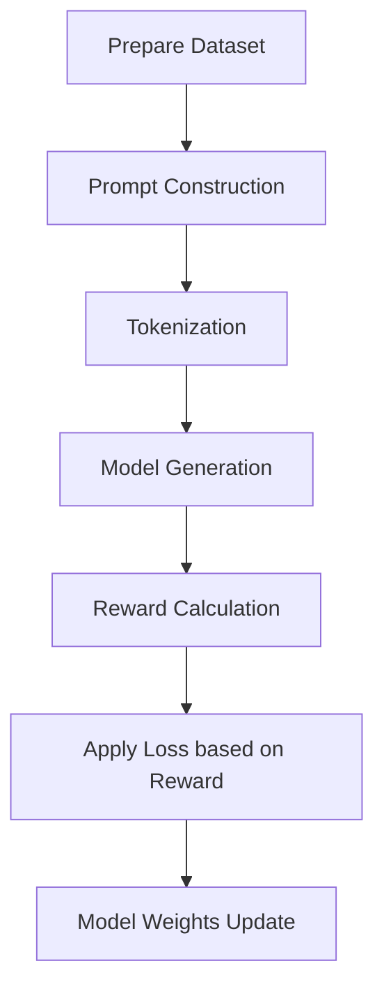

# 📚 Reward-Based Fine-Tuning of Language Models

This project demonstrates **how to fine-tune a language model based on rewards** instead of relying purely on supervised token-level loss.  
We use concepts inspired by **Proximal Policy Optimization (PPO)** to make models better follow instructions (like summarizing text to a specific number of words).

---

## 🚀 Project Flow

```
1. Prepare the Dataset
2. Create Tokenized Queries
3. Model Generates a Response
4. Compare Response to Target Goal (Reward Calculation)
5. Apply Reward as a Training Signal
6. Update the Model to Improve Future Responses
```

---

## 📑 Step-by-Step Explanation

### 1. Dataset Preparation

- We use the **OpenAI Summarize from Feedback** dataset, where each Reddit post comes with two human-written summaries and a preference (which summary is better).
- We **prompt** the model like:
  > "Summarize the text using exactly **{target_words}** words."

### 2. Tokenization

- Each input prompt is **tokenized** using a pre-trained tokenizer (`TinyLlama-1.1B-Chat`).
- Prompts and target summaries are converted into input tokens ready for the model.

---

### 3. Generation and Reward Computation

**After feeding a prompt:**

- The model generates a **response** (summary).
- We **measure** how well the response matches the **target word count**:
  - **Perfect match** → **High Reward** (+1)
  - **Slightly off** → **Small penalty**
  - **Very off** → **Larger penalty**

**Reward formula:**
```python
reward = exp(0.7 * -abs(target_length - actual_length) + log(2)) - 1
```
✅ When the generated summary has the correct number of words, the reward is close to **+1**.  
❌ If it's way off, the reward decreases towards **-1**.

---

## 🔥 Deep Dive into Reward Assignment

### Why assign **0** reward to the prompt tokens?

- The **prompt** (e.g., "Summarize the text using exactly 31 words:") is **given** to the model.
- We don't want the model to "learn" to generate the prompt again — **that's not the behavior we're training**.
- The **important part** we want the model to improve is its **generated summary**.

So:

- **Input tokens (prompt)** → **reward = 0** → **do not contribute to loss**
- **Generated tokens (response)** → **reward = positive/negative based on task success**

This masking ensures:

| | Without Masking | With Masking |
|---|---|---|
| Prompt tokens affect loss | ❌ | ✅ (prompt ignored) |
| Model focuses only on its own output | ❌ | ✅ |
| Efficient learning from real behavior | ❌ | ✅ |

---

### Intuitive Example

| Token                   | What it is             | Reward Assigned |
|--------------------------|-------------------------|-----------------|
| "Summarize"              | Prompt                  | 0               |
| "the"                    | Prompt                  | 0               |
| "story"                  | Prompt                  | 0               |
| "The fox was very smart" | Generated Response       | Positive reward |
| [PAD]                    | Padding (ignore)         | 0               |

✅ Model **only** gets reward (and hence learns) from the tokens **it generates itself**.  
✅ Model **ignores prompt and padding tokens** during training updates.

This strategy makes training **efficient**, **targeted**, and **stable**.

---

## 📈 Full Pipeline Overview



---

## 🧠 Key Training Highlights

- **Reward assigned per generated token**, not per prompt.
- **Delayed reward** after full response, like winning or losing a chess game.
- **Masking ensures** only useful tokens contribute to gradient updates.
- **Loss = Negative reward × Log-probability** → **Maximizes task success**.
- **Gradient ascent** is used to **maximize the final reward**.

---

## ✨ Why Use Reward-Based Fine-Tuning?

- Supervised learning struggles when strict behavior (like exact word counts) is needed.
- Reward modeling aligns model outputs with **human-like expectations**.
- PPO-style reward updates make models better **planners** and **instruction-followers**.

---

## 🛠️ Tech Stack

- Python 🐍
- Hugging Face 🤗 Transformers
- PyTorch ⚡
- Spacy for word counting
- PPO-inspired reward optimization

---

## 📖 References

- [Learning to Summarize from Human Feedback (OpenAI)](https://arxiv.org/abs/2009.01325)
- [Proximal Policy Optimization Algorithms (PPO Paper)](https://arxiv.org/abs/1707.06347)

---

# 🎯 Final Thought

> **Teaching a model via reward is like training an athlete: you don't cheer after every step — you reward them when they score a goal.**

Reward-based fine-tuning **helps LLMs plan**, **achieve goals**, and **deliver reliable outputs**. 🚀

## 👤 Author

For any questions or issues, please open an issue on GitHub: [@Siddharth Mishra](https://github.com/Sid3503)

---

<p align="center">
  Made with ❤️ and lots of ☕
</p>
